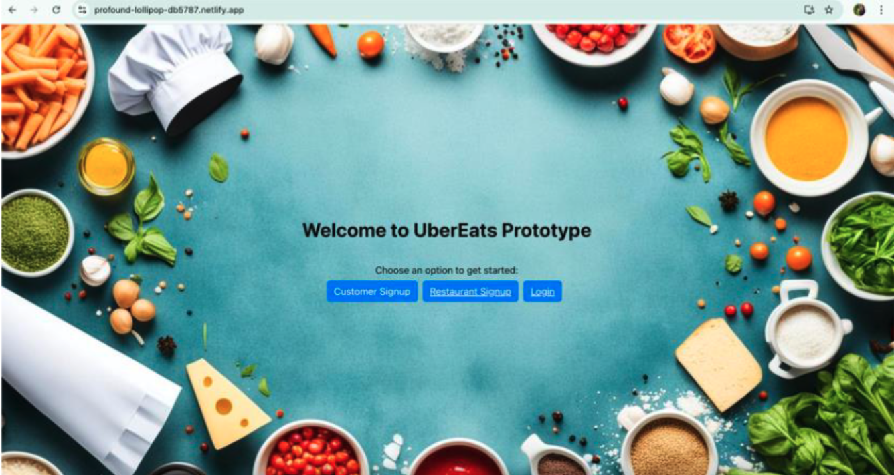

# 🚀 Uber Eats Prototype

---

## 📚 Table of Contents
1. [Project Overview](#project-overview)  
2. [Technologies Used](#technologies-used)  
3. [Setup and Deployment](#setup-and-deployment)  
   - [Part 1: System Design and Initial Deployment](#part-1-system-design-and-initial-deployment)  
   - [Part 2: Dockerizing and Kubernetes Setup](#part-2-dockerizing-and-kubernetes-setup)  
   - [Part 3: Kafka Integration](#part-3-kafka-integration)  
   - [Part 4: MongoDB Integration](#part-4-mongodb-integration)  
   - [Part 5: Redux Integration](#part-5-redux-integration)  
4. [Contributors](#contributors)  

---

### 🌐 **Live Deployment (Netlify)**
**Public IP:** `3.129.95.65`  
   - [Uber Eats Login](https://profound-lollipop-db5787.netlify.app/)
<br>
<br>



## 💡 Project Overview
This project is a functional prototype of an Uber Eats-like platform that enables user interactions between customers and restaurant owners. The goal was to design a scalable and distributed system using Django for backend development and ReactJS for the frontend, with Docker, Kubernetes, Kafka, MongoDB, and Redux integrated for enhanced performance.

### **Key Features**
- Secure user authentication with JWT.
- Role-based access control for customers and restaurant owners.
- Order management system for food delivery.
- Asynchronous messaging with Kafka.
- Scalable deployment using Docker and Kubernetes.
- Centralized state management with Redux.
- MongoDB Atlas for persistent storage.

---

## 🛠️ Technologies Used
- **Backend**: Django, Django REST Framework, Python  
- **Frontend**: React, Redux  
- **Database**: SQLite (Initial), MongoDB Atlas (Final)  
- **Deployment**: Docker, Kubernetes, Netlify, Heroku  
- **Event Streaming**: Kafka, Zookeeper  

---

## ⚙️ Setup and Deployment

### **Part 1: System Design and Initial Deployment**

#### **Backend Architecture**
- **Framework Selection**: Django REST Framework for building API endpoints.
- **Authentication**: JWT-based authentication with separate roles for customers and restaurant owners.
- **Database**: SQLite was initially used, later upgraded to MongoDB for scalability.

#### **Frontend Architecture**
- **SPA Design**: ReactJS with a component-based structure.
- **Routing & Session Management**: React Router for navigation, Axios for API calls.
- **State Management**: Redux for handling user authentication and order status.

#### **Deployment Strategy**
- **Frontend**: Deployed on Netlify.
- **Backend**: Hosted on Heroku.
- **Database**: MongoDB Atlas for persistent data storage.

---

### **Part 2: Dockerizing and Kubernetes Setup**

#### **Docker Setup**
1. Build Docker images:
   ```bash
   docker build -t backend:latest ./backend
   docker build -t frontend:latest ./frontend
   ```
2. Run containers locally:
   ```bash
   docker-compose up --build
   ```

#### **Kubernetes Deployment**
1. Start Minikube and configure Docker:
   ```bash
   minikube start
   eval $(minikube docker-env)
   ```
2. Build and load images into Minikube:
   ```bash
   docker build -t backend:latest ./backend
   minikube image load backend:latest
   docker build -t frontend:latest ./frontend
   minikube image load frontend:latest
   ```
3. Apply Kubernetes configurations:
   ```bash
   kubectl apply -f k8s/backend-deployment.yml
   kubectl apply -f k8s/backend-service.yml
   ```
4. Access services:
   ```bash
   minikube service backend-service
   ```

---

### **Part 3: Kafka Integration**
1. Install Kafka and dependencies:
   ```bash
   pip install confluent-kafka
   ```
2. Start Zookeeper and Kafka servers:
   ```bash
   bin/zookeeper-server-start.sh config/zookeeper.properties
   bin/kafka-server-start.sh config/server.properties
   ```
3. Run Kafka producer and consumer:
   ```bash
   python order_consumer.py
   ```

---

### **Part 4: MongoDB Integration**
1. Configure MongoDB in `settings.py`:
   ```python
   DATABASES = {
       'default': {
           'ENGINE': 'djongo',
           'NAME': 'ubereats',
           'CLIENT': {
               'host': 'mongodb+srv://<username>:<password>@<cluster-url>/ubereats',
               'username': '<username>',
               'password': '<password>',
               'authSource': 'admin',
           }
       }
   }
   ```
2. Install packages:
   ```bash
   pip install django pymongo dnspython bcrypt
   ```
3. Apply migrations:
   ```bash
   python manage.py makemigrations
   python manage.py migrate
   ```

---

### **Part 5: Redux Integration**
1. Install Redux dependencies:
   ```bash
   npm install @reduxjs/toolkit react-redux redux-thunk
   ```
2. Centralize state management in `src/store` with reducers and actions. Use `dispatch` to update state:
   ```javascript
   dispatch({ type: 'SET_SESSION_TOKEN', payload: response.data.access });
   ```

---
